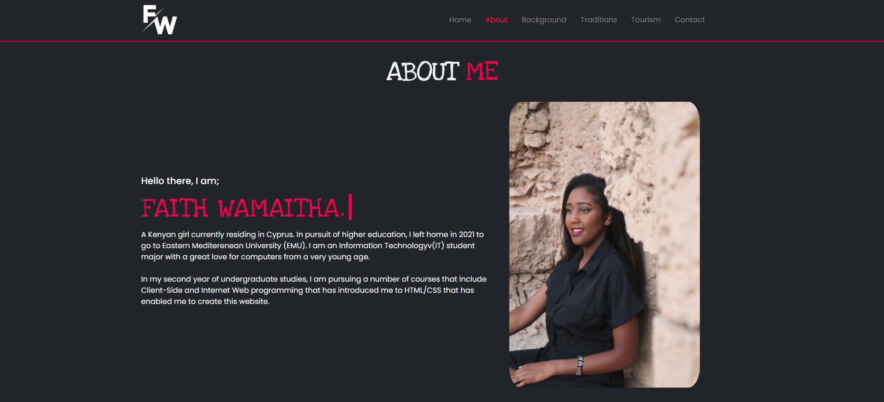

# Faith Wamaitha's Website

## Description

A freelance website created for Faith. It is a website developed for a client who wanted an easy and convenient way to present themselves to clients.

Created By: Daniel Githiomi

## Website Preview

  

## Setup/Installation Minimal Requirements
* i3 Core
* 2GB RAM
* 128GB Internal storage 

## Compatibility

  Compatible with all browsers.
  further updates on the way. 

## Technologies Used

It is made entirely using Visual Studio Code where all the following files were created and modified to achieve the output as you see it.
* HTML 5
* CSS
* Bootstrap
* Javascript

## Known Bugs
No bugs to report at the moment! the system works efficiently at 100% guaranteed. Feel free to search the output on googl to ensure that it coincides exactly.

## Link to live page
[Click-Here](https://githiomi.github.io/Faith-Website)

## Setup Instructions
* git clone [This](https://github.com/githiomi/Faith-Website) into your terminal.  
* Open the folder in your favourite editor, for example vscode ,is code . and for atom, atom . 
* Open the index.html in your browser.
* Enjoy quotevine app

## Support and contact details
Contact me through any of the following:
* Slack: danielgithiomi
* Email: danielgithiomi@gmail.com

### License
Click the following to acces the license page: [Click-Here](https://github.com/githiomi/license/blob/master/LICENSE)

Copyright (c) {2022} Dhosio Co.